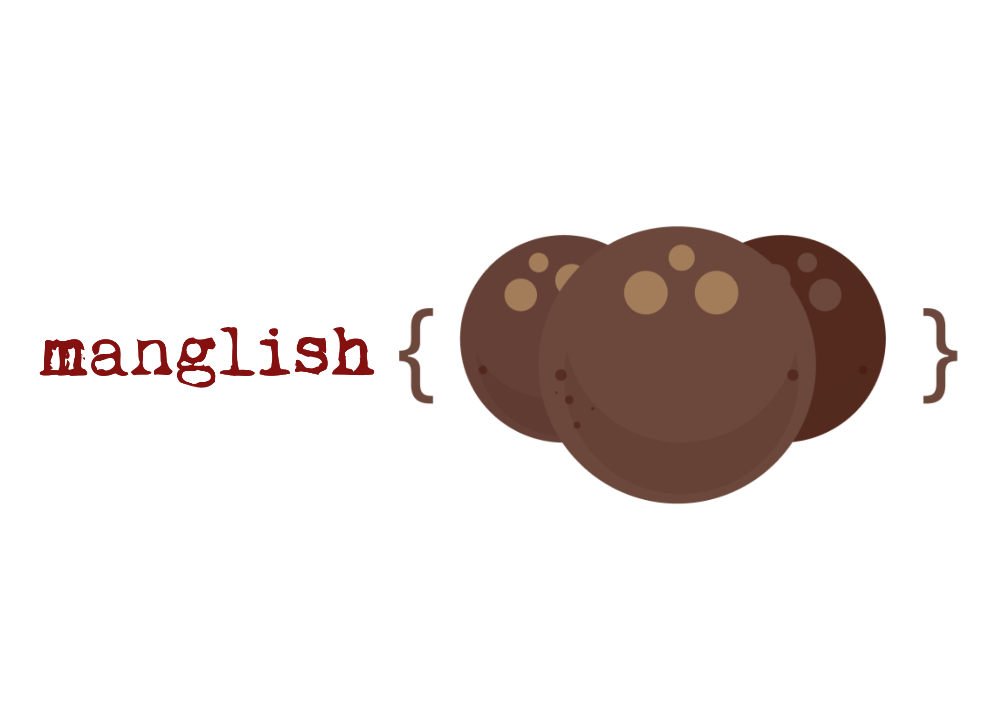

# mThengascript
## Start programming for the web in Manglish

Ever wondered what it would be like to program for the web in Manglish?
This wonder is what drove the creation of mThengascript.
With it you can start programming for the web today in Manglish.

Docs

Usage

If you want to try the live examples above, you can input Malayalam using Google Input Tools Extension.
To write code on your computer download Thengascript and include it in your code as:

Now you can start Thengascripting in two ways. Include your inline code as:

or you can also include the file using the src attribute

Lexicon

These are Manglish  equivalents of JS keywords. These are still in a tentative stage, feel free to email us if you have better suggestions.
#	 adisthanam         	     	default 
#     aanengil         		     	if 
#     allengil         		     	else 
#     aavatte              			let 
#     avastha             		 	case 
#     asadhu              			null 
#     irakkumadhi              		import 
#     ethe              				this 
#     ene              				for 
#     il              				in 
#     udhaharanamane              	instanceof 
#     uyarnatharam              		super 
#     eriyuka              			throw 
#     ennal              			enum 
#     ethetharam              		typeof 
#     ennirikke              		while 
#     oduvil              			finally 
#     oppam              			with 
#     kayattumathi              		export 
#     kalayuka              			delete 
#     kaathirikkuka              	await 
#     ganam              			class 
#     cheyuka              			do 
#     thirikkuka              		switch 
#     thiruthal              		debugger 
#     thudaruka              		continue 
#     thett              			false 
#     nalkuka              			yield 
#     nirvahikkuka              		implements 
#     parivarthanam              	var 
#     pidikkuka              		catch 
#     puthuthaye              		new 
#     prayogam              			function 
#     podhu              			public 
#     bhanttam              			package 
#     madakkam              			return 
#     mudakkuka              		break 
#     moolyanirnayam              	eval 
#     vaadam              			arguments 
#     vyartham              			void 
#     vyapipikkunnu              	extends 
#     sheri              			true 
#     shashwatham              		const 
#     shremikkuka              		try 
#     samparkkamukham              	interface 
#     surakshithamaakkapetta         protected 
#     swakarya              			private 
#     sthaayi              			static
#     kaanikkuka              		console.log 
#      munnariyippe              	alert

Check out the demos: http://studiobofa.com/ss/thengascript/#demos

Underneath the hood, it translates your code to it's ECMAscript equivalent which is then interpreted and ran by the browser.

(c) 2018 StudioBofa.

MIT License - എന്ന് വെച്ചാ basically പൊളിച്ചടക്കാമെന്ന്
